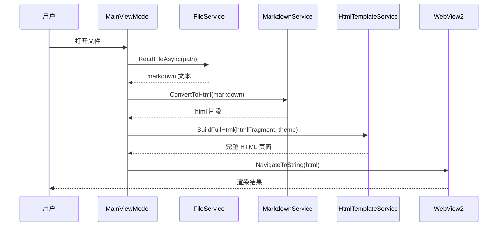

# 设计文档：Markdown 阅读器

## 概述

Markdown 阅读器是一个基于 C#/.NET 8 和 WPF 框架的桌面应用程序。核心架构采用 MVVM 模式，使用 Markdig 库解析 Markdown，通过 WebView2 控件渲染 HTML 内容。数学公式通过 KaTeX（嵌入 WebView2）渲染，Mermaid 图表通过 Mermaid.js（嵌入 WebView2）渲染。代码语法高亮使用 highlight.js。

### 技术栈

| 组件 | 技术选型 | 说明 |
|------|----------|------|
| 框架 | .NET 8 + WPF | Windows 桌面应用 |
| Markdown 解析 | Markdig | 最流行的 C# Markdown 解析库，支持 GFM 和扩展管线 |
| HTML 渲染 | WebView2 | 基于 Chromium 的嵌入式浏览器控件 |
| 数学公式 | KaTeX | 轻量级 LaTeX 渲染库，通过 JS 在 WebView2 中运行 |
| 图表渲染 | Mermaid.js | 通过 JS 在 WebView2 中渲染 Mermaid 图表 |
| 代码高亮 | highlight.js | 通过 JS 在 WebView2 中实现语法高亮 |
| PDF 导出 | WebView2 PrintToPdfAsync | 利用 WebView2 内置的 PDF 打印功能 |
| MVVM 框架 | CommunityToolkit.Mvvm | 轻量级 MVVM 工具包 |

## 架构

应用程序采用 MVVM（Model-View-ViewModel）架构模式，分为以下层次：

```mermaid
graph TB
    subgraph View层
        MainWindow[MainWindow.xaml]
        TocPanel[TocPanel 侧边栏]
        SearchBar[SearchBar 搜索栏]
        WebViewHost[WebView2 渲染区]
    end

    subgraph ViewModel层
        MainVM[MainViewModel]
        TocVM[TocViewModel]
        SearchVM[SearchViewModel]
    end

    subgraph Service层
        MarkdownService[MarkdownService]
        FileService[FileService]
        TocService[TocService]
        ThemeService[ThemeService]
        SearchService[SearchService]
        ExportService[ExportService]
        HtmlTemplateService[HtmlTemplateService]
    end

    subgraph Model层
        TocItem[TocItem]
        AppSettings[AppSettings]
        ThemeType[ThemeType]
        SearchResult[SearchResult]
    end

    MainWindow --> MainVM
    TocPanel --> TocVM
    SearchBar --> SearchVM
    WebViewHost --> MainVM

    MainVM --> MarkdownService
    MainVM --> FileService
    MainVM --> ThemeService
    MainVM --> ExportService
    MainVM --> HtmlTemplateService
    TocVM --> TocService
    SearchVM --> SearchService

    MarkdownService --> TocItem
    ThemeService --> AppSettings
    TocService --> TocItem
    SearchService --> SearchResult
end
```

### 数据流



## 组件与接口

### IMarkdownService

负责 Markdown 到 HTML 的转换。

```csharp
public interface IMarkdownService
{
    /// <summary>
    /// 将 Markdown 文本转换为 HTML 片段。
    /// 启用 GFM 扩展、数学公式扩展和代码高亮 CSS 类。
    /// </summary>
    string ConvertToHtml(string markdown);

    /// <summary>
    /// 将 Markdown 文本转换为纯文本（用于搜索）。
    /// </summary>
    string ConvertToPlainText(string markdown);
}

```

Markdig 管线配置：

```csharp
public class MarkdownService : IMarkdownService
{
    private readonly MarkdownPipeline _pipeline;

    public MarkdownService()
    {
        _pipeline = new MarkdownPipelineBuilder()
            .UseAdvancedExtensions()    // GFM 表格、任务列表、删除线等
            .UseMathematics()           // LaTeX 数学公式 $...$ 和 $$...$$
            .Build();
    }

    public string ConvertToHtml(string markdown)
    {
        return Markdig.Markdown.ToHtml(markdown, _pipeline);
    }

    public string ConvertToPlainText(string markdown)
    {
        return Markdig.Markdown.ToPlainText(markdown, _pipeline);
    }
}
```

### IFileService

负责文件 I/O 和最近文件管理。

```csharp
public interface IFileService
{
    /// <summary>读取文件内容</summary>
    Task<string> ReadFileAsync(string filePath);

    /// <summary>获取最近文件列表</summary>
    IReadOnlyList<string> GetRecentFiles();

    /// <summary>添加文件到最近列表（最多 10 条）</summary>
    void AddRecentFile(string filePath);

    /// <summary>显示文件打开对话框，返回选中的文件路径，取消返回 null</summary>
    string? ShowOpenFileDialog();

    /// <summary>显示文件保存对话框</summary>
    string? ShowSaveFileDialog(string filter, string defaultExtension);
}
```

### ITocService

负责从 Markdown 中提取目录结构。

```csharp
public interface ITocService
{
    /// <summary>
    /// 从 Markdown 文本中提取标题，生成层级目录树。
    /// </summary>
    List<TocItem> GenerateToc(string markdown);
}
```

### IThemeService

负责主题管理和持久化。

```csharp
public interface IThemeService
{
    /// <summary>当前主题</summary>
    ThemeType CurrentTheme { get; }

    /// <summary>切换主题（亮色/暗色）</summary>
    void ToggleTheme();

    /// <summary>加载保存的主题设置</summary>
    void LoadSavedTheme();

    /// <summary>主题变更事件</summary>
    event EventHandler<ThemeType>? ThemeChanged;
}
```

### ISearchService

负责文档内文本搜索。

```csharp
public interface ISearchService
{
    /// <summary>
    /// 在文本中搜索关键词，返回所有匹配结果。
    /// </summary>
    SearchResult Search(string content, string keyword);
}
```

### IExportService

负责导出功能。

```csharp
public interface IExportService
{
    /// <summary>导出为独立 HTML 文件</summary>
    Task ExportToHtmlAsync(string htmlContent, string filePath);

    /// <summary>通过 WebView2 导出为 PDF</summary>
    Task ExportToPdfAsync(Microsoft.Web.WebView2.Wpf.WebView2 webView, string filePath);
}
```

### IHtmlTemplateService

负责构建完整的 HTML 页面，嵌入 KaTeX、Mermaid.js、highlight.js 等资源。

```csharp
public interface IHtmlTemplateService
{
    /// <summary>
    /// 将 Markdown 转换后的 HTML 片段包装为完整的 HTML 页面。
    /// 包含 KaTeX 自动渲染、Mermaid.js 初始化、highlight.js 和主题样式。
    /// </summary>
    string BuildFullHtml(string htmlFragment, ThemeType theme);
}
```

## 数据模型

### TocItem - 目录项

```csharp
public class TocItem
{
    /// <summary>标题文本</summary>
    public string Title { get; set; } = string.Empty;

    /// <summary>标题级别（1-6）</summary>
    public int Level { get; set; }

    /// <summary>用于锚点跳转的 ID</summary>
    public string AnchorId { get; set; } = string.Empty;

    /// <summary>子目录项</summary>
    public List<TocItem> Children { get; set; } = new();
}
```

### SearchResult - 搜索结果

```csharp
public class SearchResult
{
    /// <summary>匹配项总数</summary>
    public int TotalMatches { get; set; }

    /// <summary>各匹配项的位置索引</summary>
    public List<int> MatchPositions { get; set; } = new();

    /// <summary>搜索关键词</summary>
    public string Keyword { get; set; } = string.Empty;
}
```

### ThemeType - 主题枚举

```csharp
public enum ThemeType
{
    Light,
    Dark
}
```

### AppSettings - 应用设置

```csharp
public class AppSettings
{
    /// <summary>当前主题</summary>
    public ThemeType Theme { get; set; } = ThemeType.Light;

    /// <summary>最近打开的文件列表</summary>
    public List<string> RecentFiles { get; set; } = new();
}
```

### HTML 模板结构

HtmlTemplateService 生成的完整 HTML 页面结构如下：

```html
<!DOCTYPE html>
<html>
<head>
    <meta charset="utf-8">
    <!-- KaTeX CSS -->
    <link rel="stylesheet" href="https://cdn.jsdelivr.net/npm/katex/dist/katex.min.css">
    <!-- highlight.js CSS（根据主题切换） -->
    <link rel="stylesheet" href="https://cdn.jsdelivr.net/npm/highlight.js/styles/{theme}.min.css">
    <!-- 自定义主题样式 -->
    <style>/* 亮色/暗色主题 CSS */</style>
</head>
<body class="{theme-class}">
    <!-- Markdown 转换后的 HTML 内容 -->
    {htmlFragment}

    <!-- KaTeX 自动渲染 -->
    <script src="https://cdn.jsdelivr.net/npm/katex/dist/katex.min.js"></script>
    <script src="https://cdn.jsdelivr.net/npm/katex/dist/contrib/auto-render.min.js"></script>
    <!-- Mermaid.js -->
    <script src="https://cdn.jsdelivr.net/npm/mermaid/dist/mermaid.min.js"></script>
    <!-- highlight.js -->
    <script src="https://cdn.jsdelivr.net/npm/highlight.js/lib/highlight.min.js"></script>
    <script>
        // 初始化 KaTeX 自动渲染
        renderMathInElement(document.body, {
            delimiters: [
                {left: "$$", right: "$$", display: true},
                {left: "$", right: "$", display: false}
            ]
        });
        // 初始化 Mermaid
        mermaid.initialize({ theme: '{mermaid-theme}' });
        // 初始化代码高亮
        hljs.highlightAll();
    </script>
</body>
</html>
```

## 正确性属性

*正确性属性是一种在系统所有有效执行中都应成立的特征或行为——本质上是关于系统应该做什么的形式化陈述。属性充当人类可读规范与机器可验证正确性保证之间的桥梁。*

### Property 1: Markdown 解析往返一致性

*For any* 有效的 Markdown 文本，使用 Markdig 解析为 HTML 后，该 HTML 应包含原始 Markdown 中所有语义元素（标题、段落、列表等）的对应 HTML 标签，且不丢失任何内容。

**Validates: Requirements 1.1, 1.6**

### Property 2: Markdown 元素到 HTML 标签的正确映射

*For any* 包含标准 Markdown 语法元素或 GFM 扩展语法元素的 Markdown 文本，解析后的 HTML 应包含与每种元素对应的正确 HTML 标签（如 `#` 映射为 `<h1>`，`**text**` 映射为 `<strong>`，围栏代码块包含正确的语言 CSS 类）。

**Validates: Requirements 1.2, 1.3, 1.4**

### Property 3: 解析器错误容错性

*For any* 任意字符串输入（包括无效 Markdown 语法），Markdown_Parser 的 ConvertToHtml 方法不应抛出异常，而应返回有效的 HTML 字符串。

**Validates: Requirements 1.7**

### Property 4: 数学公式定界符保留

*For any* 包含行内数学公式（单美元符号包裹）或块级数学公式（双美元符号包裹）的 Markdown 文本，解析后的 HTML 应保留数学公式的内容，使其可被 KaTeX 自动渲染脚本识别和处理。

**Validates: Requirements 2.1, 2.2**

### Property 5: 最近文件列表不变量

*For any* 文件打开操作序列，最近文件列表的长度不应超过 10 条，且最近打开的文件应位于列表首位。重复打开同一文件应将其移至列表首位而非产生重复条目。

**Validates: Requirements 4.4**

### Property 6: 目录生成正确性

*For any* 包含标题元素的 Markdown 文档，TOC_Generator 生成的目录树应包含文档中所有标题，且每个目录项的层级（Level）与原始标题级别一致，目录项的顺序与文档中标题出现的顺序一致。

**Validates: Requirements 5.1**

### Property 7: 搜索结果完整性

*For any* 文本内容和搜索关键词，Search_Engine 返回的匹配数量应等于关键词在文本中实际出现的次数，且每个匹配位置应准确指向关键词在文本中的起始索引。

**Validates: Requirements 6.2, 6.3**

### Property 8: 主题切换对称性

*For any* 初始主题状态，执行两次 ToggleTheme 操作后，主题应恢复为初始状态（Light → Dark → Light，Dark → Light → Dark）。

**Validates: Requirements 7.2**

### Property 9: 主题持久化往返一致性

*For any* 主题设置，保存主题偏好后重新加载，加载的主题应与保存时的主题一致。

**Validates: Requirements 7.4, 7.5**

## 错误处理

| 场景 | 处理方式 | 相关需求 |
|------|----------|----------|
| 无效 Markdown 语法 | 作为纯文本处理，不抛出异常 | 1.7 |
| 无效 LaTeX 公式 | KaTeX 显示原始文本并标记错误 | 2.4 |
| 无效 Mermaid 语法 | Mermaid.js 显示错误提示 | 3.4 |
| 文件不存在或无法读取 | 显示错误对话框，提示具体原因 | 4.6 |
| 搜索无结果 | 显示"未找到结果"提示 | 6.5 |
| 导出失败 | 显示错误信息，保持文档状态不变 | 8.4 |
| WebView2 初始化失败 | 显示降级提示，建议安装 WebView2 Runtime | - |

所有错误处理遵循以下原则：
- 不因错误导致应用崩溃
- 向用户提供明确、可操作的错误信息
- 错误发生后保持应用状态一致性

## 测试策略

### 测试框架

| 类型 | 框架 | 说明 |
|------|------|------|
| 单元测试 | xUnit | .NET 生态最流行的测试框架 |
| 属性测试 | FsCheck.Xunit | .NET 属性测试库，与 xUnit 集成 |
| 断言库 | FluentAssertions | 提供可读性强的断言语法 |

### 双重测试方法

本项目采用单元测试与属性测试互补的策略：

- **单元测试**：验证具体示例、边界情况和错误条件
- **属性测试**：验证跨所有输入的通用属性

### 属性测试配置

- 每个属性测试最少运行 100 次迭代
- 每个属性测试必须通过注释引用设计文档中的属性编号
- 标签格式：**Feature: markdown-reader, Property {number}: {property_text}**
- 每个正确性属性由一个独立的属性测试实现

### 单元测试覆盖

单元测试重点覆盖：
- Mermaid 代码块在 HTML 中的正确标记（需求 3.1）
- 文件读取和错误处理（需求 4.2, 4.6）
- HTML 导出包含完整样式（需求 8.1）
- 导出错误不影响文档状态（需求 8.4）
- 搜索无结果返回零匹配（需求 6.5）

### 属性测试覆盖

| 属性编号 | 属性名称 | 验证需求 |
|----------|----------|----------|
| Property 1 | Markdown 解析往返一致性 | 1.1, 1.6 |
| Property 2 | 元素到 HTML 标签映射 | 1.2, 1.3, 1.4 |
| Property 3 | 解析器错误容错性 | 1.7 |
| Property 4 | 数学公式定界符保留 | 2.1, 2.2 |
| Property 5 | 最近文件列表不变量 | 4.4 |
| Property 6 | 目录生成正确性 | 5.1 |
| Property 7 | 搜索结果完整性 | 6.2, 6.3 |
| Property 8 | 主题切换对称性 | 7.2 |
| Property 9 | 主题持久化往返一致性 | 7.4, 7.5 |
